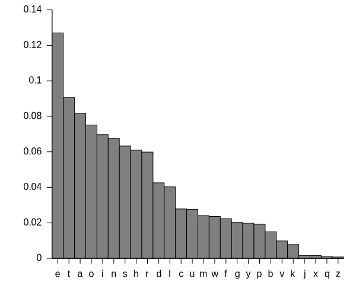

# Ciphr-Solvr: Your cipher solver

## 1. A Minimal Viable Product

You have learned how to:    
* make an HTML form to input and output text   
* use CSS to style the form and give feedback to the user   
* include the JQuery library into your project    
* use JavaScript to read text and change the letters  
* join the HTML form to the JavaScript functions   

Now you can:
* add more ciphers and deciphering tools    
* make the form even more beautiful    
* make it robust against people doing silly things
* find better ways of coding html, css & javascript

`Pro-Tip` Don't add everything at once, check all the time using form feedback and console.logging, and share your ideas :-)

## 2. More ciphers

### Morse code

The Morse Code functionality shows you how to use `JSON` to hold your alphabet.

Morse code replaces each letter with a `dot` and `dash` sequence so that the words can be keys in by a human and transmitted down a cable.

```javascript
let morse_code =
{
  "a": ".-", "b": "-...", "c": "-.-.",
  "d": "-..", "e": ".", "f": "..-.",
  "g": "--.", "h": "....", "i": "..",
  "j": ".---", "k": "-.-", "l": ".-..",
  "m": "--", "n": "-.", "o": "---",
  "p": ".--.", "q": "--.-", "r": ".-.",
  "s": "...", "t": "-", "u": "..-",
  "v": "...-", "w": ".--", "x": "-..-",
  "y": "-.--", "z": "--..", "1": ".----",
  "2": "..---", "3": "...--", "4": "....-",
  "5": ".....", "6": "-....", "7": "--...",
  "8": "---..", "9": "----.", "0": "-----"
};
```

You can extend the Morse Alphabet to include punctuation.

```javascript
function encodeMorse(message) {
  let ret = '';
  let space = " ";

  for (letter of message.toLowerCase()) {
    if (letter != space)
      ret += morse_code[letter] + " "
    else
      ret += "   "
  }
  return ret;
}
```

Morse Code is `really` interesting to learn about :-)

`Pro-Tip` JSON can be used to make *all* your cipher functions easier to understand and code.

### Dih-Dah Code

As a final step, read through the Morse code sequence of `spaces`, `dots` and `dashes`, and convert them to a sound.

The Mozilla Developer Network can help you use:
* a sound library   
* base64 data URI
* your own sound files

I have used the `base64 data URI`:   
```javascript
function beep() {
  var snd = new Audio("data:audio/wav;base64,//uQRAAAAWMSLwUIYAAsYkXgoQwAEaYLWfkWgAI0wWs/ItAAAGDgYtAgAyN+QWaAAihwMWm4G8QQRDiMcCBcH3Cc+CDv/7xA4Tvh9Rz/y8QADBwMWgQAZG/ILNAARQ4GLTcDeIIIhxGOBAuD7hOfBB3/94gcJ3w+o5/5eIAIAAAVwWgQAVQ2ORaIQwEMAJiDg95G4nQL7mQVWI6GwRcfsZAcsKkJvxgxEjzFUgfHoSQ9Qq7KNwqHwuB13MA4a1q/DmBrHgPcmjiGoh//EwC5nGPEmS4RcfkVKOhJf+WOgoxJclFz3kgn//dBA+ya1GhurNn8zb//9NNutNuhz31f////9vt///z+IdAEAAAK4LQIAKobHItEIYCGAExBwe8jcToF9zIKrEdDYIuP2MgOWFSE34wYiR5iqQPj0JIeoVdlG4VD4XA67mAcNa1fhzA1jwHuTRxDUQ//iYBczjHiTJcIuPyKlHQkv/LHQUYkuSi57yQT//uggfZNajQ3Vmz+Zt//+mm3Wm3Q576v////+32///5/EOgAAADVghQAAAAA//uQZAUAB1WI0PZugAAAAAoQwAAAEk3nRd2qAAAAACiDgAAAAAAABCqEEQRLCgwpBGMlJkIz8jKhGvj4k6jzRnqasNKIeoh5gI7BJaC1A1AoNBjJgbyApVS4IDlZgDU5WUAxEKDNmmALHzZp0Fkz1FMTmGFl1FMEyodIavcCAUHDWrKAIA4aa2oCgILEBupZgHvAhEBcZ6joQBxS76AgccrFlczBvKLC0QI2cBoCFvfTDAo7eoOQInqDPBtvrDEZBNYN5xwNwxQRfw8ZQ5wQVLvO8OYU+mHvFLlDh05Mdg7BT6YrRPpCBznMB2r//xKJjyyOh+cImr2/4doscwD6neZjuZR4AgAABYAAAABy1xcdQtxYBYYZdifkUDgzzXaXn98Z0oi9ILU5mBjFANmRwlVJ3/6jYDAmxaiDG3/6xjQQCCKkRb/6kg/wW+kSJ5//rLobkLSiKmqP/0ikJuDaSaSf/6JiLYLEYnW/+kXg1WRVJL/9EmQ1YZIsv/6Qzwy5qk7/+tEU0nkls3/zIUMPKNX/6yZLf+kFgAfgGyLFAUwY//uQZAUABcd5UiNPVXAAAApAAAAAE0VZQKw9ISAAACgAAAAAVQIygIElVrFkBS+Jhi+EAuu+lKAkYUEIsmEAEoMeDmCETMvfSHTGkF5RWH7kz/ESHWPAq/kcCRhqBtMdokPdM7vil7RG98A2sc7zO6ZvTdM7pmOUAZTnJW+NXxqmd41dqJ6mLTXxrPpnV8avaIf5SvL7pndPvPpndJR9Kuu8fePvuiuhorgWjp7Mf/PRjxcFCPDkW31srioCExivv9lcwKEaHsf/7ow2Fl1T/9RkXgEhYElAoCLFtMArxwivDJJ+bR1HTKJdlEoTELCIqgEwVGSQ+hIm0NbK8WXcTEI0UPoa2NbG4y2K00JEWbZavJXkYaqo9CRHS55FcZTjKEk3NKoCYUnSQ0rWxrZbFKbKIhOKPZe1cJKzZSaQrIyULHDZmV5K4xySsDRKWOruanGtjLJXFEmwaIbDLX0hIPBUQPVFVkQkDoUNfSoDgQGKPekoxeGzA4DUvnn4bxzcZrtJyipKfPNy5w+9lnXwgqsiyHNeSVpemw4bWb9psYeq//uQZBoABQt4yMVxYAIAAAkQoAAAHvYpL5m6AAgAACXDAAAAD59jblTirQe9upFsmZbpMudy7Lz1X1DYsxOOSWpfPqNX2WqktK0DMvuGwlbNj44TleLPQ+Gsfb+GOWOKJoIrWb3cIMeeON6lz2umTqMXV8Mj30yWPpjoSa9ujK8SyeJP5y5mOW1D6hvLepeveEAEDo0mgCRClOEgANv3B9a6fikgUSu/DmAMATrGx7nng5p5iimPNZsfQLYB2sDLIkzRKZOHGAaUyDcpFBSLG9MCQALgAIgQs2YunOszLSAyQYPVC2YdGGeHD2dTdJk1pAHGAWDjnkcLKFymS3RQZTInzySoBwMG0QueC3gMsCEYxUqlrcxK6k1LQQcsmyYeQPdC2YfuGPASCBkcVMQQqpVJshui1tkXQJQV0OXGAZMXSOEEBRirXbVRQW7ugq7IM7rPWSZyDlM3IuNEkxzCOJ0ny2ThNkyRai1b6ev//3dzNGzNb//4uAvHT5sURcZCFcuKLhOFs8mLAAEAt4UWAAIABAAAAAB4qbHo0tIjVkUU//uQZAwABfSFz3ZqQAAAAAngwAAAE1HjMp2qAAAAACZDgAAAD5UkTE1UgZEUExqYynN1qZvqIOREEFmBcJQkwdxiFtw0qEOkGYfRDifBui9MQg4QAHAqWtAWHoCxu1Yf4VfWLPIM2mHDFsbQEVGwyqQoQcwnfHeIkNt9YnkiaS1oizycqJrx4KOQjahZxWbcZgztj2c49nKmkId44S71j0c8eV9yDK6uPRzx5X18eDvjvQ6yKo9ZSS6l//8elePK/Lf//IInrOF/FvDoADYAGBMGb7FtErm5MXMlmPAJQVgWta7Zx2go+8xJ0UiCb8LHHdftWyLJE0QIAIsI+UbXu67dZMjmgDGCGl1H+vpF4NSDckSIkk7Vd+sxEhBQMRU8j/12UIRhzSaUdQ+rQU5kGeFxm+hb1oh6pWWmv3uvmReDl0UnvtapVaIzo1jZbf/pD6ElLqSX+rUmOQNpJFa/r+sa4e/pBlAABoAAAAA3CUgShLdGIxsY7AUABPRrgCABdDuQ5GC7DqPQCgbbJUAoRSUj+NIEig0YfyWUho1VBBBA//uQZB4ABZx5zfMakeAAAAmwAAAAF5F3P0w9GtAAACfAAAAAwLhMDmAYWMgVEG1U0FIGCBgXBXAtfMH10000EEEEEECUBYln03TTTdNBDZopopYvrTTdNa325mImNg3TTPV9q3pmY0xoO6bv3r00y+IDGid/9aaaZTGMuj9mpu9Mpio1dXrr5HERTZSmqU36A3CumzN/9Robv/Xx4v9ijkSRSNLQhAWumap82WRSBUqXStV/YcS+XVLnSS+WLDroqArFkMEsAS+eWmrUzrO0oEmE40RlMZ5+ODIkAyKAGUwZ3mVKmcamcJnMW26MRPgUw6j+LkhyHGVGYjSUUKNpuJUQoOIAyDvEyG8S5yfK6dhZc0Tx1KI/gviKL6qvvFs1+bWtaz58uUNnryq6kt5RzOCkPWlVqVX2a/EEBUdU1KrXLf40GoiiFXK///qpoiDXrOgqDR38JB0bw7SoL+ZB9o1RCkQjQ2CBYZKd/+VJxZRRZlqSkKiws0WFxUyCwsKiMy7hUVFhIaCrNQsKkTIsLivwKKigsj8XYlwt/WKi2N4d//uQRCSAAjURNIHpMZBGYiaQPSYyAAABLAAAAAAAACWAAAAApUF/Mg+0aohSIRobBAsMlO//Kk4soosy1JSFRYWaLC4qZBYWFRGZdwqKiwkNBVmoWFSJkWFxX4FFRQWR+LsS4W/rFRb/////////////////////////////////////////////////////////////////////////////////////////////////////////////////////////////////////////////////////////////////////////////////////////////////////////////////////////////////////////////////////////////////////////////////////////////////////////////////////////////////////////////////////////////////////////////////////////////////////////////////////////////////VEFHAAAAAAAAAAAAAAAAAAAAAAAAAAAAAAAAAAAAAAAAU291bmRib3kuZGUAAAAAAAAAAAAAAAAAAAAAAAAAAAAAAAAAAAAAAAAAAAAAAAAAAAAAAAAAAAAAAAAAMjAwNGh0dHA6Ly93d3cuc291bmRib3kuZGUAAAAAAAAAACU=");
  snd.play();
}

// setInterval(beep, 5000);
```

### Substitution cipher

The Morse Code shows you how to do it :-)

i) your JSON alphabet with a shuffled correspondence

```javascript
let abc_code =
{
  "a": "z", "b": "y", "c": "x",
  "d": "w", "e": "v", "f": "u",
  "g": "s", "h": "s", "i": "r",
  "j": "q", "k": "p", "l": "o",
  "m": "n", "n": "m", "o": "l",
  "p": "k", "q": "j", "r": "i",
  "s": "h", "t": "g", "u": "f",
  "v": "e", "w": "d", "x": "c",
  "y": "b", "z": "a", "1": "1",
  "2": "2", "3": "3", "4": "4",
  "5": "5", "6": "6", "7": "7",
  "8": "8", "9": "9.", "0": "0"
};
```

This alphabetic test is not particularly random.

See if you can use the JavaScript `Math.random` to make a really random alphabet.

ii) translating your message

```javascript
function encode(message) {
  let ret = '';
  let space = " ";

  for (letter of message.toLowerCase()) {
    if (letter != space)
      ret += abc_code[letter]
    else
      ret += "   "
  }
  return ret;
}
```


### Affine cipher

`Affine` is a maths word you are already know with multiplication tables, sequences and graphs.

Each letter is shifted using the function `(ax + b) % 26`.

In fact, the Caesar cipher is an Affine cipher where:
* `a` is 0 .  
* `b` is the Caesar shift . 
* `% 26` is to ensure that our index gets a valid letter .   

The code below uses the Affine function to give the letters in the substitution alphabet.

```javascript
function handleAffine() {
  a = 5;
  b = 2;

  // generate the new affine alphabet
  for (letter in alphabet) {
    index = (a * letter + b) % alphabet.length
    abc_code[alphabet.charAt(letter)] = 
    alphabet.charAt(index);
  }

  outputMessage = encodeAffine(abc_code, inputMessage)
  outputText.text(outputMessage);
}
```

/* gwr station login
Er!c!dl3
monty python
flying circus
rabbit
*/

### Book cipher

Simply use a page of a book (a large piece of text) to find the cipher shifting key.


## 3. Deciphering tools

### Letter Frequency charts

The frequency of single letters and letters in combination is widely used in word games, in electronic communication, in linguistics and in deciphering codes.

The letter frequency in speech and written text is well know, so comparing numbers of letters in the coded message can give a clue for translation.



### Dictionary Search


## 4. Even more beautiful

Add a banner to your Ciphr-Solvr and name it for yourself :-)

The banner I made uses SVG text, made beautiful by the CSS styling we added earlier.

```javascript
<svg width="600" height="100">
		<text x="20" y="30" class="heavy">bcs-</text>
		<text id="cat" x="80" y="30" class="heavy">ciphers</text>
		<text x="55" y="60" class="heavy">Caesar</text>
		<text id="grumpy" x="150" y="60" class="Rrrrr">Shift!</text>
</svg>
```

### Choose your own text!


